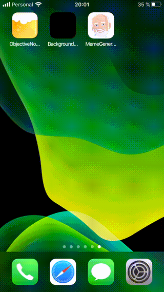

# iOS Meme Generator

## Overview

This app was made using the [ImgFlip Meme API](https://api.imgflip.com).
It allows the user to download and make use of several meme templates.
The custom template option is in progress.

## Setup and run

All dependencies are built with Carthage, to install them, use `carthage update --platform iOS`.

A **ImgFlip Meme API User** is required to run the project. It can be added by adding the file: `MemeGenerator/SupportFiles/APICredentials.plist`, with the following content:

```
<?xml version="1.0" encoding="UTF-8"?>
<!DOCTYPE plist PUBLIC "-//Apple//DTD PLIST 1.0//EN" "http://www.apple.com/DTDs/PropertyList-1.0.dtd">
<plist version="1.0">
<dict>
        <key>username</key>
        <string>YOUR_USERNAME</string>
        <key>pass</key>
        <string>YOUR_PASS</string>
</dict>
</plist>
```

## DEMO


